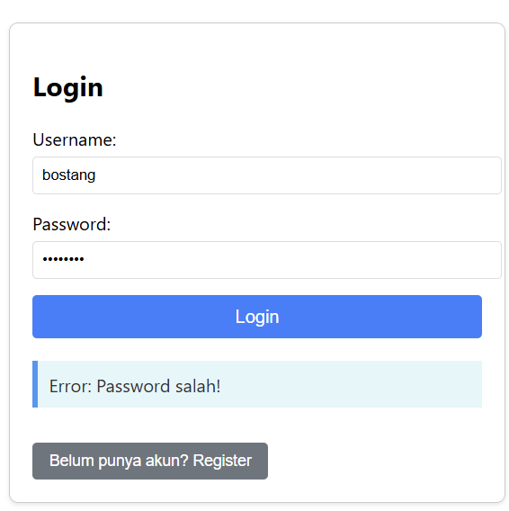
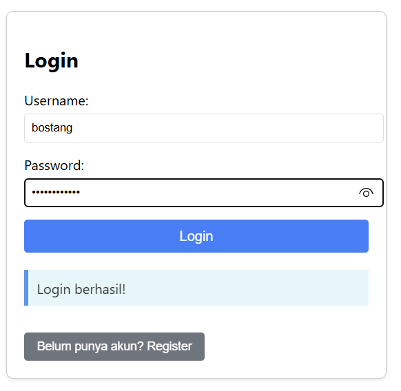
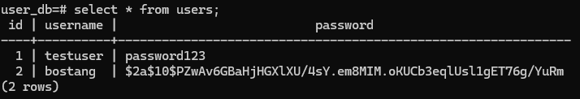

# Simple Login Form

sebuah frontend sederhana untuk testing connect frontend (berbasis JS React) ke backend.

## Arsitektur

```conf
PORT_BE=8083
PORT_DUKCAPIL=8082
PORT_FE=3000
```

## Cara Menjalankan

### Langkah 0 : Inisiasi database

```bash
# jalankan DB_initialization.sql
psql -U postgres -f DB_initialization.sql
```

### Langkah 1 : Buat & Jalankan Backend

```bash
# LANGKAH 1 : buat project dgn Spring Initalizr
# dependencies:
    # - Spring Web
    # - Spring Boot DevTools

# LANGKAH 2 : buat seluruh file di src

# LANGKAH 3: JALANKAN APLIKASI SPRINGBOOT
mvn spring-boot:run
```

### Langkah 2 : Buat & Jalankan Frontend

```bash
# CATATAN : buat dari folder fe kosong! jangan pakai yang ada di github repo, karena node_modules ter-ignore.

# LANGKAH 1 : BUAT TEMPLATE KOSONG PROJECT REACT
# sintaks:
    # npx create-react-app <nama_folder>
npx create-react-app fe  

# LANGKAH 2 : INSTALL DEPENDENCY
cd fe # masuk ke dalam folder proyek

npm install react-bootstrap bootstrap
# untuk interaksi API (lebih baik dari fetch)
npm install axios

# Declarative routing for React web applications
npm install react-router-dom

# LANGKAH 3 : ubah:
# - src/App.js 
# -src/components/AuthForm.js 
# -src/pages/LandingPage.js 
# -src/pages/DashboardPage.js 

# LANGKAH 4 : jalankan app react
npm start

# LANGKAH 5 : akses via web localhost
localhost:3000
```

## TIPS DEBUGGING U/ DEVOPS

```bash
docker ps

docker exec -it [nama_container / ID container] [command]

docker compose down -v

docker compose up --build
```

## Demonstrasi (DEPRECATED)

tampilan frontend (password salah) :



tampilan frontend (password benar) :



tampilan pada log backend:


tampilan DB :


