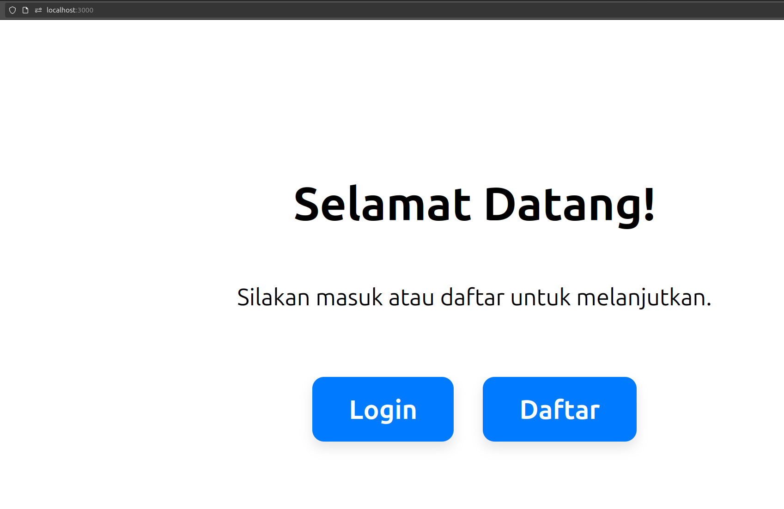

# Simple Login Form

sebuah frontend sederhana untuk testing connect frontend (berbasis JS React) ke backend.

## Arsitektur

```conf
PORT_BE=8083
PORT_DUKCAPIL=8082
PORT_FE=3000
```

## Cara Menjalankan

### Langkah 0 : Inisiasi database

```bash
# jalankan DB_initialization.sql
psql -U postgres -f DB_initialization.sql
psql -U postgres -f DB_validaor_initialization.sql
```

Pastikan pada `application.properties`, `username=postgres` dan `passowrd` sudah sesuai password postgres local anda.

### Langkah 1 : Buat & Jalankan Backend

```bash
# LANGKAH 1 : buat project dgn Spring Initalizr
# dependencies:
    # - Spring Web
    # - Spring Boot DevTools

# LANGKAH 2 : buat seluruh file di src

# LANGKAH 3: JALANKAN APLIKASI SPRINGBOOT
mvn spring-boot:run
```

lakukan untuk `be` dan `eksternal_dukcapil`

### Langkah 2 : Buat & Jalankan Frontend

```bash
npm install
npm start
```

### Langkah 3 : Akses Frontend via web

`localhots:3000`

## CATATAN TAMABAHAN

### CARA MEMBUAT PROJECT REACT DARI KOSONG

```bash
# CATATAN : buat dari folder fe kosong! jangan pakai yang ada di github repo, karena node_modules ter-ignore.

# LANGKAH 1 : BUAT TEMPLATE KOSONG PROJECT REACT
# sintaks:
    # npx create-react-app <nama_folder>
npx create-react-app fe  

# LANGKAH 2 : INSTALL DEPENDENCY
cd fe # masuk ke dalam folder proyek

npm install react-bootstrap bootstrap
# untuk interaksi API (lebih baik dari fetch)
npm install axios

# Declarative routing for React web applications
npm install react-router-dom

# LANGKAH 3 : ubah:
# - src/App.js 
# -src/components/AuthForm.js 
# -src/pages/LandingPage.js 
# -src/pages/DashboardPage.js 

# LANGKAH 4 : jalankan app react
npm start

# LANGKAH 5 : akses via web localhost
localhost:3000
```

## Demonstrasi



## TESTING REGISTRASI (cURL)

- **Registrasi**

```bash
curl -X POST \
  http://localhost:8083/api/auth/register \
  -H 'Content-Type: application/json' \
  -d '{
    "namaLengkap": "Dewi Kartika",
    "nik": "3201010000000004",
    "namaIbuKandung": "Mary Doe",
    "nomorTelepon": "081234567890",
    "email": "john.doe@example.com",
    "password": "JohnDoe123!",
    "tipeAkun": "BNI Taplus",
    "tempatLahir": "Jakarta",
    "tanggalLahir": "1990-05-15",
    "jenisKelamin": "Laki-laki",
    "agama": "Islam",
    "statusPernikahan": "Janda",
    "pekerjaan": "Software Engineer",
    "sumberPenghasilan": "Gaji",
    "rentangGaji": ">Rp100 juta",
    "tujuanPembuatanRekening": "Tabungan",
    "kodeRekening": 1001,
    "alamat": {
      "namaAlamat": "Jl. Sudirman No. 123, RT 001/RW 002",
      "provinsi": "DKI Jakarta",
      "kota": "Jakarta Pusat",
      "kecamatan": "Tanah Abang",
      "kelurahan": "Bendungan Hilir",
      "kodePos": "10210"
    },
    "wali": {
      "jenisWali": "Ayah",
      "namaLengkapWali": "Robert Doe",
      "pekerjaanWali": "Pensiunan",
      "alamatWali": "Jl. Sudirman No. 123, RT 001/RW 002",
      "nomorTeleponWali": "081298765432"
    }
}'
```

- **Login**

```bash
curl -X POST \
  http://localhost:8083/api/auth/login \
  -H 'Content-Type: application/json' \
  -d '{
    "email": "john.doe@example.com",
    "password": "JohnDoe123!"
  }'
```
