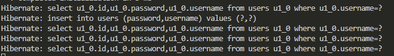

# Simple Login Form

sebuah frontend sederhana untuk testing connect frontend (berbasis JS React) ke backend.

## Cara Menjalankan

### Langkah 1 : Buat & Jalankan Backend

```bash
# LANGKAH 1 : buat project dgn Spring Initalizr
# dependencies:
    # - Spring Web
    # - Spring Boot DevTools

# LANGKAH 2 : buat file

# LANGKAH 3: JALANKAN APLIKASI SPRINGBOOT
mvn spring-boot:run
```

### Langkah 2 : Buat & Jalankan Frontend

```bash

# LANGKAH 1 : BUAT TEMPLATE KOSONG PROJECT REACT
# sintaks:
    # npx create-react-app <nama_folder>
npx create-react-app simple_form    

# LANGKAH 2 : INSTALL DEPENDENCY
cd simple_form # masuk ke dalam folder proyek
npm install react-bootstrap bootstrap

# LANGKAH 3 : ubah src/App.js

# LANGKAH 4 : jalankan app react
npm start

# LANGKAH 5 : akses via web localhost
localhost:3000
```

## Demonstrasi


tampilan pada log :

